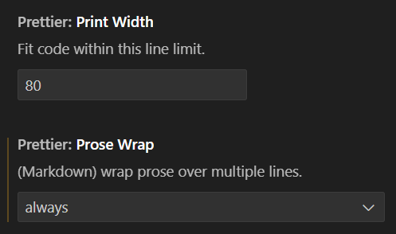

# Contributing to Open Source Pages of Lund University

Welcome! This repository hosts open web pages related to education and research
at [Lund University, Sweden](https://www.lunduniversity.lu.se/). The project is
organized by contributions from university employees and the broader community.

## 🌍 For External Contributors (Students, Others)

We welcome contributions from students, alumni, and anyone who wants to improve
or add useful educational content. You can help by:

1. **Creating an issue:**

   If you have noticed a typo, a broken link, or have suggestions for new
   content, you can contribute by opening an issue. Go to the
   [issue tracker](https://github.com/lunduniversity/lunduniversity.github.io/issues)
   and describe what you want to change or add. This helps us understand your
   proposal and discuss it with you.

1. **Making a Pull Request**

   If you're familiar with Git and GitHub, you can contribute by **forking**
   this repository, making your changes, and submitting a **pull request (PR)**.
   This is a great way to propose improvements, fixes, or new content.

   Here’s how to do it:

   ### 🔁 Step 1: Fork the repository

   Click the **"Fork"** button in the upper right corner of this GitHub
   repository page. This will create a personal copy of the repository under
   your own GitHub account.

   ### 💻 Step 2: Clone and make your changes

   1. Clone your fork to your local machine:

      ```bash
      git clone https://github.com/<your-username>/<repo-name>.git
      cd <repo-name>
      ```

   1. Create a new branch for your changes:

      ```bash
      git checkout -b my-feature
      ```

   1. Make your changes. You can:

      - Improve existing pages
      - Fix typos or broken links
      - Update or clarify instructions
      - Suggest new content

      See the section **"Tool recommendations"** below for helpful tips and
      tools.

   ### ⚙️ Step 3: Build the HTML

   If you add or modify `.md` files under `src/`, you **must regenerate the
   corresponding HTML files** using Pandoc.

   1. Ensure there is a `build.sh` script in the relevant subdirectory that
      defines how the Markdown is built.

   1. Make sure this script is called from the **top-level `build.sh`** in the
      root directory.

   1. Run the top-level script, from the root directory:

      ```bash
      ./build.sh
      ```

   1. Review the generated `.html` files and verify they look correct.

      > **🚫 Do not edit `.html` files manually.** Always edit the Markdown
      > source files in `src/`. Because the HTML files are automatically
      > generated, they will be **overwritten**.

      > **✅ Important:** Commit both:
      >
      > - Your updated or new Markdown files
      > - The corresponding generated `.html` files

   ### 📤 Step 4: Push and create your pull request

   1. Push your branch to your GitHub fork:

      ```bash
      git push origin my-feature
      ```

   1. Visit your fork on GitHub, and GitHub will prompt you to **create a pull
      request**.

   1. In the pull request description, include:

      - A **short summary** of your changes
      - **Why** you made them
      - Any additional context that may be useful

## 🧑‍🏫 For Lund University Employees

If you are a teacher or employee at LU and would like to host your course or
project here, or your personal page, please follow these steps:

1. **Create an issue:**  
   Go to the
   [issue tracker](https://github.com/lunduniversity/lunduniversity.github.io/issues)
   and describe:

   - Who you are (include a link to an official LU or LTH page)
   - What course or project you want to publish
   - Why you want to publish it here

2. **Discuss your proposal:**  
   We'll respond in the issue thread and guide you through the next steps. Once
   we agree on the details, we will create a new folder for your course or
   project under `src/`. This folder will be your workspace for all content
   related to your course or project.

3. **Set up your structure:**  
   Inside your course or project directory, organize your content according to
   the structure outlined in the `Page Organization` section below.

4. **Build your site:** Include your `build.sh` script in the root build script,
   so it will be built when you run the top-level `build.sh`. This will ensure
   that your course or project is included in the overall site. Include it by
   adding a line like this to the top-level `build.sh`:

   ```bash
   source src/yourcourse/build.sh
   ```

## 📄 Page Organization

Each course, project or personal page must live in its own subdirectory under
`src/`, and should follow this structure:

<pre>
src/
    yourpage/
        index.md ← Your course content in Markdown
        build.sh ← Script to build the HTML using Pandoc
        otherfiles/ ← Any other files you need
</pre>

Replace `yourpage` with the name of your course, project, or your own name (for
personal pages), following the naming convention below.

### 🔤 Naming Convention

- Use **lowercase letters only**
- No spaces, dashes, underscores, or special characters
- For **courses**, use a **short, stable acronym** that reflects the course
  title in swedish or english.
  - The acronym must be **unique** and **unlikely to change**
  - **Do not use the course code**, as it may change over time (e.g., use `pgk`
    rather than `EDAB05`)
- For **personal pages**, use your full name in lowercase (e.g., `johndoe`)
  - If your name isn't unique, append a number or other identifier (e.g.,
    `johndoe2`)

### 📁 Root Directory Contents

The root of the repository contains shared files:

- `top.html`: Entry page with links to all subpages
- `style.css`: Shared stylesheet used across all pages
- `build.sh`: Top-level build script that builds all subpages by sourcing their
  `build.sh` scripts

## 🔧 Building Pages

Each page directory under `src/` must include a `build.sh` script to generate
the corresponding HTML file using [Pandoc](https://pandoc.org/). The resulting
HTML file must be placed outside of the `src/` directory, in a subdirectory with
the same name as the page directory. For example, if your page is in
`src/yourpage/`, the generated HTML file should be in `yourpage/index.html`.

The build script must be runnable from the root of the repository, and we
recommend including a path check to ensure the script is run from the correct
location.

Below is a basic example of a `build.sh` script for a page. It includes a path
check to ensure it is run from the root of the repository, creates its own
subdirectory, and generates a HTML file using Pandoc.

```bash
#!/usr/bin/bash

###############################################################################
### Make sure the script is run from the root of the repository ###############
###############################################################################
REPO_ROOT=$(cd "$(git rev-parse --show-toplevel)"; pwd)
CURRENT_DIR=$(pwd)

if [ "$CURRENT_DIR" != "$REPO_ROOT" ]; then
    echo "Please run this script from the root of the repository."
    echo "Current: $CURRENT_DIR"
    echo "Expected: $REPO_ROOT"
    exit 1
fi
###############################################################################

mkdir -p yourpage
pandoc \
  -s \                             # Use standalone mode (includes full HTML structure)
  --toc \                          # Add a table of contents
  -c ../style.css \                # Link to the shared stylesheet
  -B top.html \                    # Insert content from top.html at the beginning of the body
  --metadata title="Your title" \  # Set the page title (used in the HTML <title> tag)
  src/yourpage/index.md \          # Your Markdown source file
  -o yourpage/index.html           # Output file

```

- Replace `yourpage` with the name of your course, project, or personal page.
- The `top.html` file includes the LU header, and should always be included.
- **Tip:** Adjust relative paths (`../style.css`, `top.html`, etc.) if your
  subdirectory is nested deeper or organized differently.

### 🧱 Including Your Script in the Top-Level Build

To make sure your page is built when the repository is built, add a line to the
top-level `build.sh`:

```bash
source src/yourcourse/build.sh
```

This runs your script as part of the global build process.

**Note:** The top-level `build.sh` script is responsible for building all
subpages. It should include a line for each subpage's `build.sh` script. It is
also responsible for creating the landing page (root `index.html`) that links to
all subpages. The top-level `build.sh` script additionally runs the `dos2unix`
command on all HTML files to ensure that Windows-style line endings are
converted to Unix-style line endings. This is important for compatibility across
different operating systems and to avoid files being committed unnecessarily
when no content changes have been made.

> 🔁 If you're renaming or moving folders, don't forget to update the top-level
> script too!

## 🛠️ Tool Recommendations

For running the build script, we recommend using a terminal with Bash support.
If you're on Windows, you can use [Git Bash](https://gitforwindows.org/) or
[WSL](https://docs.microsoft.com/en-us/windows/wsl/install) (Windows Subsystem
for Linux) to run the build script. If you're using a Mac or Linux, you can use
the built-in terminal.

> **Important!**  
> In order to run the build script, you need to have
> [Pandoc](https://pandoc.org/) installed. You can install it using your package
> manager or by downloading it from the
> [Pandoc website](https://pandoc.org/installing.html).

For working with this repo in your own fork we recommend using VS Code, and the
following extensions for a better editing experience:

- **Prettier - Code formatter** (by _Prettier_): For automatic code formatting.
  In the VS Code settings page for Prettier, set **Print Width** to `80` and
  **Prose Wrap** to `always`. See figure below.

  

- **Live Server** (by _Ritwick Dey_): For live preview of your changes. This
  extension runs a minimal web server and opens your default browser to view the
  HTML files. It also supports hot reloading, which means:

  - you can edit the Markdown files in VS Code
  - save the changes and run the `build.sh` script to generate the HTML files
  - the Live Server will automatically refresh the browser

- **Run on Save** (by _emeraldwalk_): This extension allows you to run a command
  every time you save a file. You can set it up to run the `build.sh` script
  automatically when you save your files. This way, you don't have to remember
  to run the build script manually. Works nicely together with the Live Server
  extension.

  As an example, you can add the following to your VS Code settings
  (`.vscode/settings.json`):

  ```json
  {
    "emeraldwalk.runonsave": {
      "shell": "bash",
      "commands": [
        {
          "match": ".*",
          "isAsync": true,
          "cmd": "${workspaceFolder}/build.sh"
        }
      ]
    }
  }
  ```

  This will run the `build.sh` script every time you save any file in your
  workspace.

## 📜 License and Attribution

All contributions are, unless otherwise stated, licensed under CC-BY-SA. This
means:

- You retain copyright.
- Others can reuse and adapt your content, with attribution, under the same
  license.
- By contributing, you agree to these terms.

## ✉️ Questions?

Currently, the best way to communicate with us is by
[opening an issue](https://github.com/lunduniversity/lunduniversity.github.io/issues).
